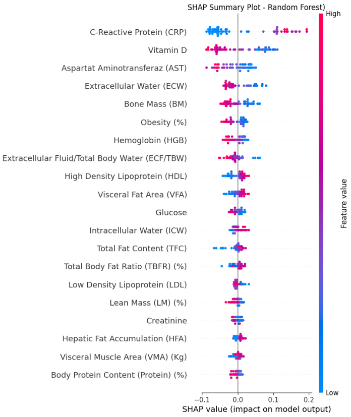
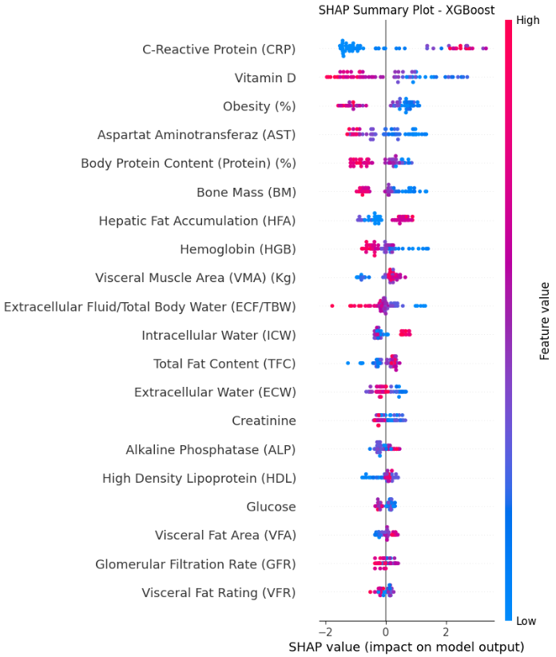
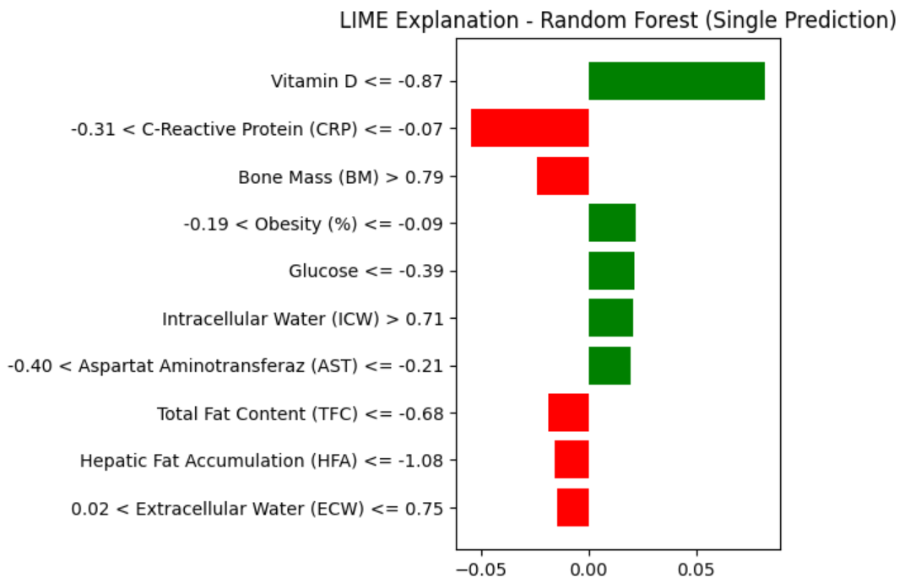
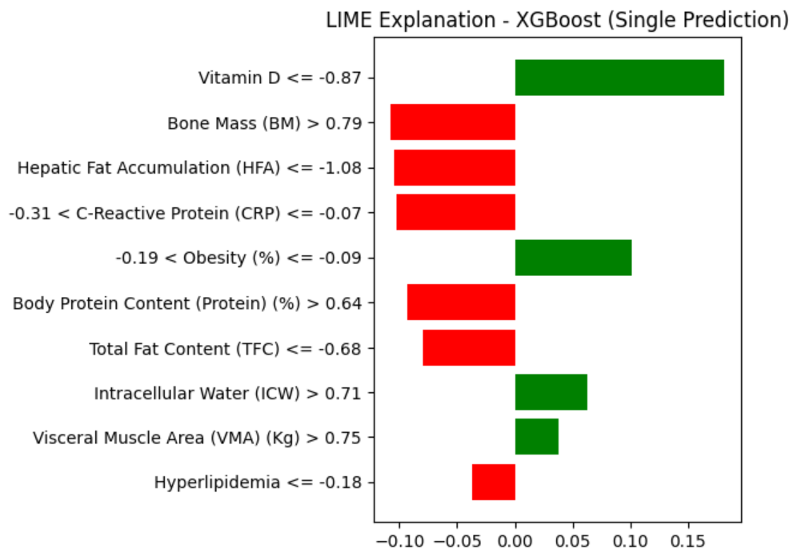

# Gallstone Disease ML Classification

This project applies machine learning models to predict gallstone disease using clinical and body-composition data. The workflow includes preprocessing, Grid Search hyperparameter tuning, model evaluation, and explainable AI using SHAP and LIME.

## Project Objective

The objective is to predict `Gallstone Status` and compare multiple classification models to identify the best-performing model.

## Dataset

The dataset contains 319 patient records with 38 input features and one target column:

* Target: `Gallstone Status`
* Features: clinical and body-composition variables such as CRP, Vitamin D, AST, Obesity, Bone Mass, Extracellular Water, Intracellular Water, Hemoglobin, and others.

## What Was Done

In `gallstone_ml_classification.ipynb`, the following steps were performed:

* Loaded and inspected the dataset.
* Checked for missing values and duplicate records.
* Split the dataset into features and target.
* Applied train-test splitting.
* Scaled the features using `StandardScaler`.
* Trained Random Forest, XGBoost, SVM, and Decision Tree models.
* Applied Grid Search to find the best hyperparameter combination for each model.
* Evaluated models using Accuracy, Precision, Recall, AUC, and F1-score.
* Used SHAP and LIME to explain model behavior.

## Models and Results

### Random Forest

Best hyperparameters:

```python
{
    "max_depth": None,
    "max_features": "log2",
    "min_samples_leaf": 2,
    "min_samples_split": 2,
    "n_estimators": 100
}
```

Test results:

| Metric    |    Value |
| --------- | -------: |
| Accuracy  | 0.796875 |
| Precision |  0.78125 |
| Recall    |  0.80645 |
| AUC       |  0.87096 |
| F1-score  |  0.79365 |

Random Forest achieved good recall, meaning it detected many actual gallstone cases. However, its 100% training accuracy showed signs of overfitting.

---

### XGBoost

Best hyperparameters:

```python
{
    "colsample_bytree": 0.8,
    "learning_rate": 0.2,
    "max_depth": 5,
    "n_estimators": 200,
    "subsample": 1.0
}
```

Test results:

| Metric    |   Value |
| --------- | ------: |
| Accuracy  | 0.87500 |
| Precision | 0.87096 |
| Recall    | 0.87096 |
| AUC       | 0.91006 |
| F1-score  | 0.87096 |

XGBoost achieved the best overall performance. It had the highest Accuracy, Precision, Recall, AUC, and F1-score, so it was selected as the best model.

---

### SVM

Best hyperparameters:

```python
{
    "C": 1,
    "gamma": "scale",
    "kernel": "linear"
}
```

Test results:

| Metric    |   Value |
| --------- | ------: |
| Accuracy  | 0.79687 |
| Precision | 0.84615 |
| Recall    | 0.70967 |
| AUC       | 0.90224 |
| F1-score  | 0.77192 |

SVM showed stable behavior and better generalization than the overfitting models, but its recall was lower. In a medical task, this is important because lower recall means more missed gallstone cases.

---

### Decision Tree

Best hyperparameters:

```python
{
    "max_depth": 3,
    "min_samples_leaf": 4,
    "min_samples_split": 2
}
```

Test results:

| Metric    |   Value |
| --------- | ------: |
| Accuracy  | 0.65625 |
| Precision | 0.73684 |
| Recall    | 0.45161 |
| AUC       | 0.77761 |
| F1-score  | 0.56000 |

Decision Tree had the weakest performance. Its low recall showed that it missed many gallstone cases, which makes it unsuitable as the final model.

## Overall Model Comparison

| Model         | Accuracy | Precision |  Recall |     AUC | F1-score |
| ------------- | -------: | --------: | ------: | ------: | -------: |
| Random Forest | 0.796875 |   0.78125 | 0.80645 | 0.87096 |  0.79365 |
| XGBoost       |  0.87500 |   0.87096 | 0.87096 | 0.91006 |  0.87096 |
| SVM           |  0.79687 |   0.84615 | 0.70967 | 0.90224 |  0.77192 |
| Decision Tree |  0.65625 |   0.73684 | 0.45161 | 0.77761 |  0.56000 |

## Explainable AI

SHAP and LIME were used to understand how the models made predictions.

SHAP explains the global behavior of the model across the dataset, while LIME explains one single prediction.

---

### SHAP - Random Forest

This SHAP plot shows how Random Forest used the features across the full dataset. CRP, Vitamin D, AST, Extracellular Water, and Bone Mass were among the most influential features.

The model behaved by giving strong importance to medical and body-composition features, but the effects were not as clearly separated as XGBoost.



---

### SHAP - XGBoost

This SHAP plot shows that XGBoost relied strongly on features such as CRP, Vitamin D, Obesity, AST, Body Protein Content, and Bone Mass.

Compared with Random Forest, the feature effects appeared more separated and consistent, which supports why XGBoost achieved the best test performance.



---

### LIME - Random Forest

This LIME plot explains one Random Forest prediction. Green bars pushed the prediction toward gallstones, while red bars pushed it away from gallstones.

For this specific case, Vitamin D had the strongest positive effect. CRP and Bone Mass pushed the prediction in the opposite direction. This shows that the Random Forest decision for this case depended heavily on a few key medical features.



---

### LIME - XGBoost

This LIME plot explains one XGBoost prediction. Vitamin D had the strongest positive effect on predicting gallstones. Obesity, Intracellular Water, and Visceral Muscle Area also supported the positive prediction.

On the other hand, Bone Mass, Hepatic Fat Accumulation, CRP, Body Protein Content, and Total Fat Content pushed the prediction away from gallstones.



## XAI Summary

The XAI results showed that the models did not make predictions randomly. They relied on medical and body-composition features such as CRP, Vitamin D, AST, Obesity, Bone Mass, and body-water measurements.

XGBoost showed stronger and more consistent feature effects, while Random Forest also captured useful patterns but showed more overfitting risk.

## Weaknesses and Limitations

* The dataset is small, which may limit generalization.
* Random Forest and XGBoost showed signs of overfitting because they reached 100% training accuracy.
* Decision Tree underfitted and performed poorly.
* The models were not tested on an external hospital dataset.
* No feature selection was applied, so some noisy features may still be included.
* The models should support medical decision-making, not replace doctors.
* SHAP and LIME improve interpretability, but they do not prove clinical reliability.

## Tools and Libraries

* Python
* Pandas
* NumPy
* Scikit-learn
* XGBoost
* Matplotlib
* SHAP
* LIME
* Jupyter Notebook

## How to Run

1. Clone the repository:

```bash
git clone https://github.com/OsamaHasan1/gallstone-disease-ml-classification.git
```

2. Install the required libraries:

```bash
pip install -r requirements.txt
```

3. Open and run:

```text
gallstone_ml_classification.ipynb
```

## Conclusion

This project compared four machine learning models for gallstone disease prediction. XGBoost achieved the best performance, while Random Forest and SVM achieved moderate results. Decision Tree was the weakest model.

SHAP and LIME were used to explain model behavior and show which features influenced the predictions. This is important in medical machine learning because model decisions should be understandable, not treated as black-box outputs.
